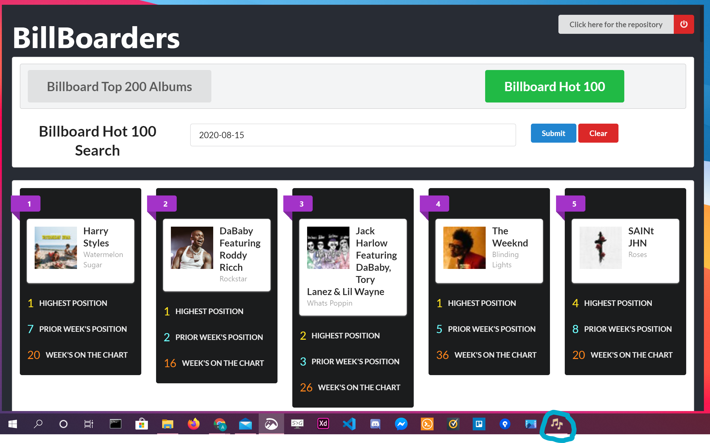

# Billboarders

> _Note: I'm currently still working on this_

This desktop Application queries billboard for either its `Top 200 Greatest Albums of All-Time`, or its weekly `Hot 100` (based on week entered).

## Quick Instructions

To create a light dev version

```
git clone https://github.com/AhmedAlihashi/billboarders.git
npm install or yarn install
npm run start or yarn start
```

You can download the pre-built version [here](https://mega.nz/file/ijQ3RYTQ#Z5plqMR5-gLxG0MgneCWZTDz2GbedujV_1azbqPYx7I)

Alternativly you can build your own version locally

```
git clone https://github.com/AhmedAlihashi/billboarders.git
npm install or yarn install
npm run build-win or yarn build~win
```

# Screen Shot

</img>
